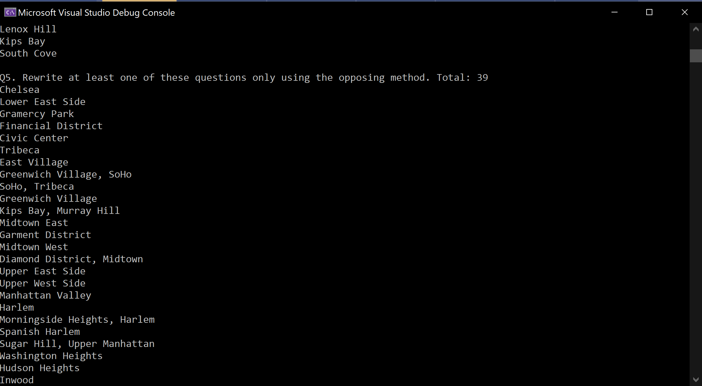

# Lab09-LINQ
Code Fellows 401: Lab 09.

## Introduction

Lab09 - LINQ

Authors: Bade Habib

----

## Attributions

Sources used when putting together code.


----

## Description
This is a C# console application to practically apply concepts of JSON serailization and LINQ. This is done by simulating creating several LINQ statements to filter data from a JSON file.

---

### Getting Started
Clone this repository to your local machine.

```
$ git clone [x]
```

### To run the program from Visual Studio:
Select ```File``` -> ```Open``` -> ```Project/Solution```

Next navigate to the location you cloned the Repository.

Double click on the ```Lab09-LINQ``` directory.

Then select and open ```Lab09-LINQ.sln```

---
### Visuals
#### Question 5


---
### Change Log
- Initial commit
- Added JSON Serialization and JSON data-related classes
- Added Question 1 and Question 2
- Added Question 3 and Question 4
- Added Question 5
- Added visual and updated README
